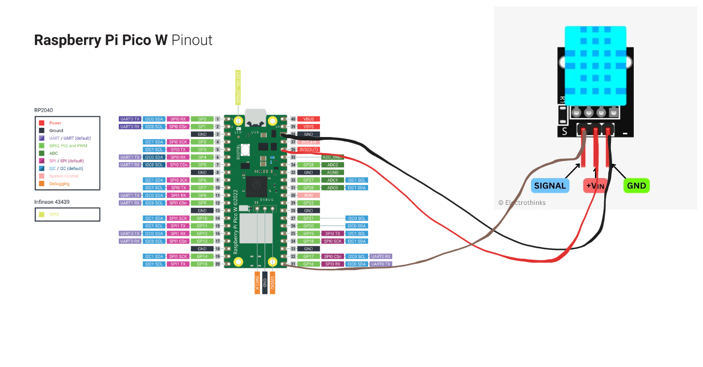
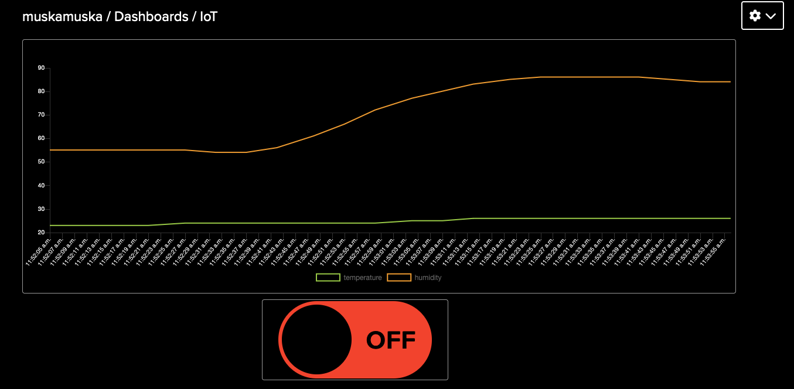

## Tutorial on how to build a temperature and humidity sensor

### Title

Building a Temperature and Humidity Sensor and presentation of data with Pico WH and Adafruit IO

### Author

Jonathan Flores (jf223mu)

### Project Overview

This project involves creating a temperature and humidity sensor using a Raspberry Pi Pico WH, a DHT11 sensor, and Adafruit IO for data visualization. The device reads temperature and humidity data and sends it to Adafruit IO, where the data can be monitored in real-time through a dashboard. The project also includes a LED that can be controlled remotely via Adafruit IO.

### Estimated Time

Approximation: 6-7 hours (Depending on your programming skills)

---

### Objective

The purpose of this project is to create a simple IoT device that can monitor environmental conditions, because I'm working 100% at the time I have choosen a smaller project. By collecting temperature and humidity data, you can gain insights into the ambient conditions of a specific location, which can be useful for applications such as home automation, weather monitoring, and greenhouse etcetera.

- **Why this project?**: To learn how to build and connect IoT devices and use cloud platforms for data visualization.
- **Purpose**: To monitor environmental conditions remotely.
- **Insights**: Understanding environmental trends, real-time monitoring, and potential automation based on data.
- **FYI**:
 We used my source code for the project with several pico's at my job to gain an average value of the temperature and the humidity (Not documented in this project).

---

### Material

- **Raspberry Pi Pico WH**: A microcontroller with Wi-Fi capability.
- **DHT11 Sensor**: Measures temperature and humidity.
- **Jumper Wires**: For connecting components.
- **Micro USB Cable**: For power and programming the Pico WH.

#### Cost and Purchase Locations

I bought my equipment from [Electrokit](https://www.electrokit.com/en/)

- **Raspberry Pi Pico WH**: 109 SEK 
- **Digital temperature and humidity sensor DHT11**: 39 SEK
- **Jumper Wires 20-pin 30cm female/female**: 23 SEK
- **Micro-USB male to USB female adapter black**: 29 SEK 

---

### Computer Setup

### Computer Setup

#### Chosen IDE

For this project, the chosen Integrated Development Environment (IDE) is Visual Studio Code (VSCode) with the Pymakr plugin. VSCode is a popular, versatile code editor that supports various programming languages and offers many extensions to enhance development workflows.

#### How the Code is Uploaded (Workflow)

The code is uploaded to the Raspberry Pi Pico W using the Pymakr plugin in VSCode. Pymakr simplifies the process of writing and deploying MicroPython code to microcontrollers. Here's a step-by-step workflow for uploading the code:

1. **Write Code in VSCode**: Write the MicroPython code in VSCode using the Pymakr extension.
2. **Connect Pico W to Computer**: Connect the Raspberry Pi Pico W to the computer using a micro USB cable.
3. **Open Pymakr Terminal**: Open the Pymakr terminal in VSCode.
4. **Sync Code**: Use the "Sync" button in the Pymakr terminal to upload the code from the local project directory to the Pico W.
5. **Run Code**: The code will automatically run on the Pico W after being uploaded.

#### Steps for Setting Up Your Computer

1. **Install Python**:
   - Download and install Python from [python.org](https://www.python.org/).

2. **Install Node.js**:
   - Download and install Node.js from [nodejs.org](https://nodejs.org/).

3. **Install Visual Studio Code**:
   - Download and install VSCode from [code.visualstudio.com](https://code.visualstudio.com/).
   - Follow the installation instructions for your operating system.

4. **Install MicroPico**:
   - Open VSCode and go to the Extensions view by clicking on the Extensions icon in the Activity Bar or pressing `Ctrl+Shift+X`.
   - Search for "MicroPico" and click "Install" to add the extension to VSCode.

5. **Set Up Pymakr**:
   - After installing MicroPico, connect your Raspberry Pi Pico WH to your computer.

6. **Flash MicroPython Firmware**:
   - Download the latest MicroPython firmware for Raspberry Pi Pico WH from the [MicroPython website](https://micropython.org/download/rp2-pico-w/).
   - Put the Pico WH into bootloader mode by holding down the BOOTSEL button while connecting it to your computer via USB (A white small button).
   - The Pico WH should appear as a USB mass storage device.
   - Copy the downloaded firmware file to the Pico WH. It will automatically flash the firmware and reboot.

7. **Write and Upload Code**:
   - Write your MicroPython code in a new file in VSCode.
   - Use the MicroPico extension to sync and upload your code to the Pico WH by right-clicking on a file and upload it.

By following these steps, you can set up your development environment, write MicroPython code, and upload it to the Raspberry Pi Pico WH efficiently.
   
---

### Putting Everything Together

#### Circuit Diagram

This is a simple circuit diagram showing how the components are connected:



Wiring Instructions for Raspberry Pi Pico WH with DHT11 Sensor
Components Needed:

    Raspberry Pi Pico WH
    DHT11 Temperature and Humidity Sensor
    Jumper Wires

Wiring Steps:

    Power Connection:
        Connect the VCC pin of the DHT11 sensor to the 3V3(OUT) pin on the Raspberry Pi Pico WH (pin 36).

    Signal Connection:
        Connect the Signal pin of the DHT11 sensor to the GP16 pin on the Raspberry Pi Pico WH (pin 21).

    Ground Connection:
        Connect the GND pin of the DHT11 sensor to the GND pin on the Raspberry Pi Pico WH (pin 38).

Summary:

    VCC (DHT11) to 3V3(OUT) (Pico WH) - Pin 36
    Signal (DHT11) to GP16 (Pico WH) - Pin 21
    GND (DHT11) to GND (Pico WH) - Pin 38

The DHT11 sensor is then programmed to read temperature and humidity values and display them on the Adafruit IO dashboard. The sensor’s power supply range is between 3V to 5.5V DC, and most USB ports can provide 5V power. The sensor includes a built-in 1kΩ resistor, eliminating the need for an additional resistor for this project. Using jumper wires, this setup allows for easy connection of the DHT11 sensor to the Raspberry Pi Pico WH, making it ideal for development. For a production-like setup, consider using PCBs (Printed Circuit Boards), enclosures for the electronics, and a more permanent power supply.

---

### Platform

- **Platform Choice**: Adafruit IO

**Functionality**: Cloud service for IoT projects with data storage, visualization, MQTT support for real-time data transmission, REST API, and automated triggers.

**Why Adafruit IO?**
- **Ease of Use**: Intuitive interface and excellent documentation.
- **Real-Time Data**: Effective monitoring with MQTT.
- **Free Tier**: Ample resources for small projects.
- **Community Support**: Extensive tutorials and forums.
- **Scalability**: Paid plans for larger projects.

**Alternatives**:
- **ThingSpeak**: MATLAB integration but limited free tier.
- **Blynk**: Excellent mobile app support, higher costs for scaling.

**Future Options**:
- **Paid Subscription**: More resources.
- **Local Installation**: Complete data control.
- **Integration**: AWS, Google Cloud, or Azure IoT for advanced features.

Adafruit IO balances ease of use, functionality, and scalability for IoT projects.

---

### The Code

[The Source Code](https://github.com/JonathanFlores8/IoT-Summer)

#### Main Code Snippet

```python
from machine import Pin
from utime import sleep
from dht import DHT11
import network_manager
import mqtt_manager

# Ensure Wi-Fi is connected
if not network_manager.wlan.isconnected():
    print("Wi-Fi connection failed. Exiting...")
    exit()

# Connect to Adafruit IO MQTT broker
mqtt_client = mqtt_manager.connect()

# Pin setup for DHT11 sensor
sensor = DHT11(Pin(16))

# Pin setup for LED
led_pin = Pin("LED", Pin.OUT)

# Callback for MQTT messages
def message_callback(topic, msg):
    if topic == bytes(mqtt_manager.AIO_FEED_CONTROLLER, 'utf-8'):
        led_state = msg == b"ON"
        led_pin.value(led_state)
        print(f"Received message: {msg.decode()} - LED state: {'ON' if led_state else 'OFF'}")

mqtt_client.set_callback(message_callback)
mqtt_client.subscribe(mqtt_manager.AIO_FEED_CONTROLLER)

try:
    while True:
        sensor.measure()
        temperature = sensor.temperature()
        humidity = sensor.humidity()
        print(f'Temperature: {temperature}°C Humidity: {humidity}%')
        mqtt_manager.send_data(mqtt_client, mqtt_manager.AIO_FEED_TEMPERATURE, temperature)
        mqtt_manager.send_data(mqtt_client, mqtt_manager.AIO_FEED_HUMIDITY, humidity)
        mqtt_client.check_msg()
        sleep(5)
except KeyboardInterrupt:
    print("Script interrupted by user. Disconnecting...")
finally:
    mqtt_client.disconnect()
    print("Disconnected from Adafruit IO MQTT Broker. Exiting...")
```
### Code Explanation

1. **Import Libraries and Modules:**
   - `Pin` from the `machine` module: Used for controlling GPIO pins.
   - `sleep` from the `utime` module: Pauses the program for a given amount of time.
   - `DHT11` from the `dht` module: Reads data from the DHT11 temperature and humidity sensor.
   - `network_manager`: Custom module for managing network connections.
   - `mqtt_manager`: Custom module for managing MQTT (Message Queuing Telemetry Transport) connections.

2. **Ensure Wi-Fi is connected:**
   - Checks if the device is connected to Wi-Fi. If not, it prints an error message and exits the program.

3. **Connect to Adafruit IO MQTT Broker:**
   - Uses the `mqtt_manager` module to connect to the Adafruit IO MQTT broker and assigns the MQTT client to `mqtt_client`.

4. **Set up DHT11 Sensor:**
   - Initializes the DHT11 sensor on GPIO pin 16.

5. **Set up LED Pin:**
   - Initializes the built-in LED pin for output.

6. **Define Callback Function for MQTT Messages:**
   - `message_callback` function: Executes when a message is received on a subscribed topic. It checks if the message is to turn the LED ON or OFF and updates the LED state accordingly.

7. **Subscribe to MQTT Topic:**
   - Sets the callback function for MQTT messages.
   - Subscribes to a specific MQTT topic (defined in `mqtt_manager.AIO_FEED_CONTROLLER`).

8. **Main Loop:**
   - Continuously reads temperature and humidity data from the DHT11 sensor.
   - Prints the temperature and humidity to the console.
   - Sends the temperature and humidity data to the Adafruit IO feeds using MQTT.
   - Checks for incoming MQTT messages.
   - Pauses for 5 seconds before repeating.

9. **Graceful Shutdown:**
   - If the script is interrupted by the user (e.g., pressing Ctrl+C), it disconnects from the MQTT broker and prints a message indicating the disconnection.

---

### Data Flow / Connectivity

- **Data Transmission Frequency**: Every 5 seconds.
- **Wireless Protocol**: Wi-Fi.
- **Transport Protocol**: MQTT.

---

### Presenting the Data

1. **Dashboard Setup**:
   - Create a new dashboard on Adafruit IO.
   - Add blocks for temperature, humidity, and an on/off toggle switch for the LED.
   - Configure blocks to link to the appropriate feeds.
2. **Data Visualization**:
   - Real-time data updates on the dashboard.
   - Historical data can be viewed through Adafruit IO's data storage.

#### Example Dashboard



- **Data Persistence**: Data is saved based on Adafruit IO's retention policy (typically available for free tier users for a limited time).

---

### Finalizing the Design

- **Project Results**:
  - Successfully monitored and visualized temperature and humidity.
  - Remote control of the LED via Adafruit IO.

### Summary and Conclusion

**The Failed Project:**

At first my project was to use a custom backend and frontend setup to visualize the data, but I faced several challenges that made it more practical to use Adafruit IO for data visualization. The challenges included limited support for SSL/TLS connections in MicroPython, complex setup requirements, time-consuming debugging, infrastructure management complexities, data security concerns, real-time data handling difficulties, and resource constraints on the Raspberry Pi Pico WH.

If my time wasn't limited I would have continued. I spent roughly about 15 hours on the failed project.

1. **MicroPython Limitations**: Limited support for SSL/TLS connections in the `simple` library made secure MQTT communication difficult.
2. **Complex Setup**: Integrating a React frontend with an Express backend and ensuring seamless communication with the Raspberry Pi Pico WH was challenging.
3. **Time-Consuming Debugging**: Troubleshooting network, MQTT, and SSL/TLS issues required significant effort.
4. **Infrastructure Management**: Setting up and maintaining a custom server infrastructure for the backend, ensuring uptime, and handling potential scalability issues added complexity.
5. **Data Security**: Ensuring secure data transmission and storage required careful configuration and management of certificates and encryption methods.
6. **Real-Time Data Handling**: Implementing efficient real-time data streaming and visualization required significant coding and optimization.
7. **Resource Constraints**: Limited processing power and memory on the Pico WH necessitated optimized code and efficient resource management.

Due to these challenges, it was more practical to use Adafruit IO for data visualization. Adafruit IO offers a streamlined, secure, and user-friendly platform, allowing for quick integration and reliable data insights without the need for a complex custom backend and frontend setup. This approach saved time and reduced the complexity of managing infrastructure, ensuring secure and efficient real-time data visualization. 

#### Video Presentation

[Project Demonstration Video](https://youtu.be/xocmH745gcM)

---
